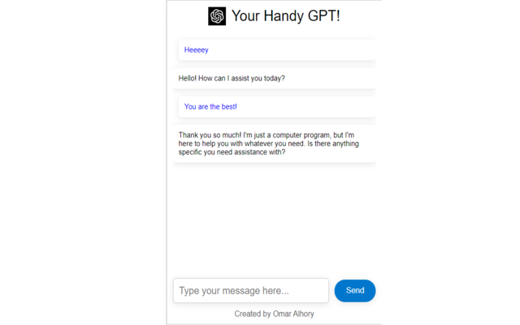

# Handy-GPT --> Google Chrome Extension

A simple Chrome extension that allows users to interact with GPT-3 AI models.

## Installation

To install the extension, follow these steps:

1. Add the extension from the Chrome Web Store: https://chrome.google.com/webstore/detail/gpt-35-turbo-extension/eebpjloikjhhpklemoapjdpnaekgiclk/
2. Go to Options in the Extensions settings and put your OPENAI API Key
3. Click on the extension icon in your browser toolbar to launch it.

## Usage

Once the extension is installed, simply open it and start typing your message in the input field. Press enter or click the send button to send your message to the AI model. The AI's response will appear in the chat box.

## Contributing

We welcome contributions from the community! To contribute, follow these steps:

1. Fork this repository.
2. Make your changes and commit them to your forked repository.
3. Submit a pull request with your changes.

## License

This project is licensed under the MIT License - see the LICENSE file for details.

Author: @OmarHory
